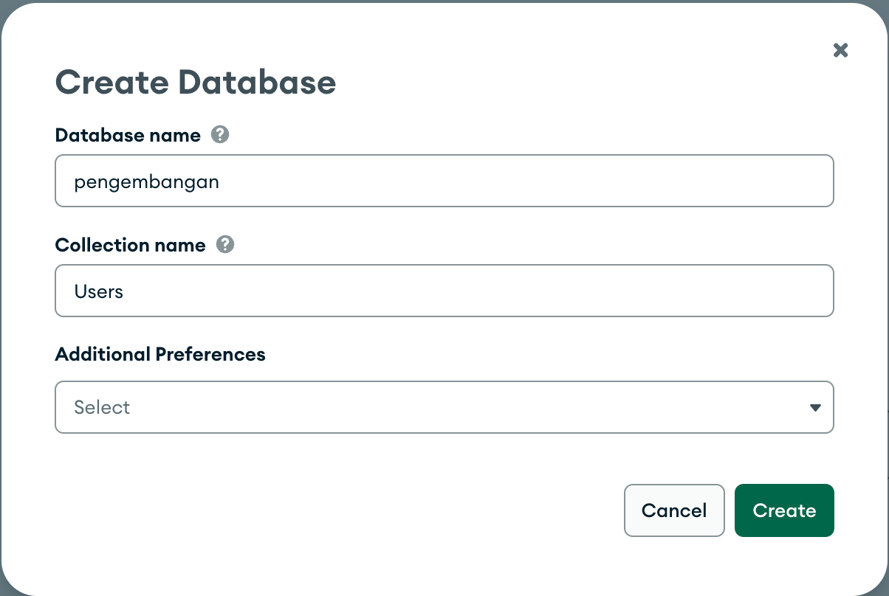
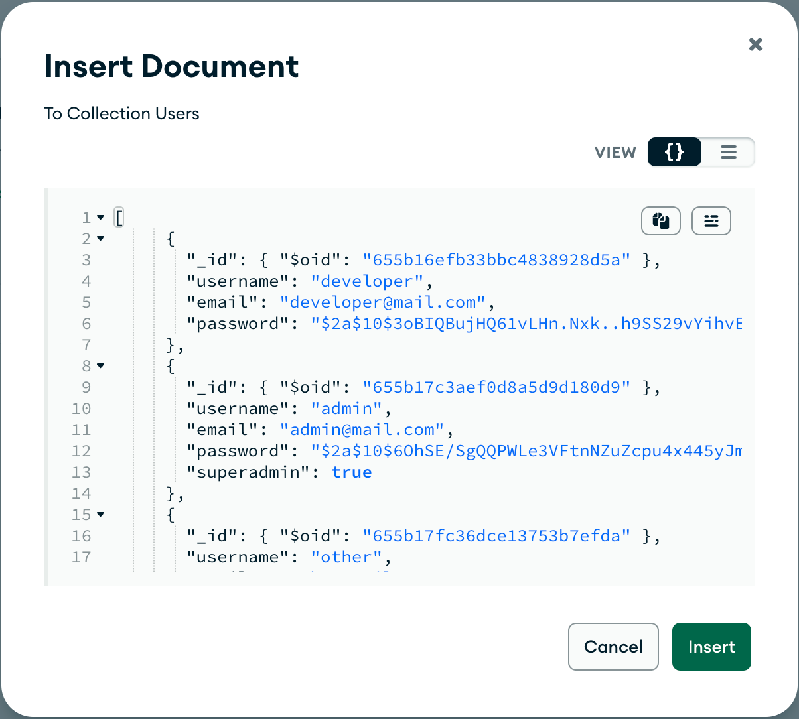

# Education NextJS - Route Handler & Authentication

## Table of Content

- [Disclaimer](#disclaimer)
- [Scope Pembelajaran](#scope-pembelajaran)
- [Demo](#demo)
  - [Step 0a - Membuat Collection pada Atlas](#step-0a---membuat-collection-pada-atlas)
- [References](#references)

## Disclaimer

- Pada pembelajaran ini kita akan menggunakan `MongoDB` sebagai database untuk melakukan authentication. Untuk itu, kita akan menggunakan `MongoDB Atlas` sebagai layanan database yang akan kita gunakan.

  Pastikan sudah memiliki akun terlebih dahulu di [MongoDB Atlas](https://www.mongodb.com/cloud/atlas).

- Pembelajaran ini menggunakan kode dari pembelajaran sebelumnya yang sudah dimodifikasi sedikit yah. Jadi jangan kaget bila starter code-nya berbeda dengan end code pada pembelajaran sebelumnya

- Pembelajaran ini menggunakan package `jsonwebtoken` sebagai pembuat JWT yang akan disimpan pada cookies, namun, apabila menggunakan `Vercel`, sebenarnya lebih disarankan untuk menggunakan package `jose` yah !

## Scope Pembelajaran

- Route Handler
- Middleware
- Authentication in NextJS

## Demo

Sampai pada titik ini kita sudah menggunakan NextJS pada sisi "FrontEnd" untuk melakukan fetching data dan memutasikan data. Pada pembelajaran kali ini kita akan menggunakan NextJS pada sisi "BackEnd" untuk membuat API sederhana sampai dengan membuat Authentication dengan NextJS yah.

### Step 0a - Membuat Collection pada Atlas

Pada langkah ini kita akan membuat Collection pada MongoDB Atlas dan melakukan seeding data pada collection tersebut secara manual (manual entry via Atlas)

1. Membuka browser dan menuju ke [MongoDB Atlas](https://www.mongodb.com/cloud/atlas)
1. Login ke akun MongoDB Atlas dan membuka Project yang akan digunakan
1. Pilih database yang digunakan kemudian pilih `Browse Collections`
1. Pilih `+ Create Database` (bila sudah memiliki database) atau `Add My Own Data` (bila belum memiliki database)
1. Ketik database name `pengembangan`
1. Ketik collection name `Users`
1. Pada kolom `Additional Preferences`, akan kita kosongkan
1. Tekan tombol `create`

   

1. Pada halaman collection `Users` yang sudah dibuat, pilih `INSERT DOCUMENT`
1. Pada modal `Insert Document ini`, pilih `VIEW` yang berbentuk `{}`, kemudian masukkan data di bawah ini pada kolom tersebut

   ```json
   [
     {
       "_id": { "$oid": "655b16efb33bbc4838928d5a" },
       "username": "developer",
       "email": "developer@mail.com",
       "password": "$2a$10$3oBIQBujHQ61vLHn.Nxk..h9SS29vYihvE9CqrPi6yTxFYm1uixgm"
     },
     {
       "_id": { "$oid": "655b17c3aef0d8a5d9d180d9" },
       "username": "admin",
       "email": "admin@mail.com",
       "password": "$2a$10$6OhSE/SgQQPWLe3VFtnNZuZcpu4x445yJm5cgdVZxfb6AYpCKtdkC",
       "superadmin": true
     },
     {
       "_id": { "$oid": "655b17fc36dce13753b7efda" },
       "username": "other",
       "email": "other@mail.com",
       "password": "$2a$10$6SA9Z5J8aD0QyuQSfFBC4uMb2JIfHnpJHKN75V0q0zIELlxWQzK9W",
       "original_name": "Just Another"
     }
   ]
   ```

1. Tekan tombol `Insert`

   

Sampai pada tahap ini, kita sudah berhasil untuk memasukkan data yang dimiliki ke dalam Atlas yah.

### Step 0b - Membuat Konfigurasi Driver MongoDB

Pada langkah ini kita akan membuat konfigurasi awal untuk menggunakan driver mongodb agar dapat terkoneksi dengan Atlas via package `mongodb`.

Adapun langkah-langkahnya adalah sebagai berikut:

1. Membuka [halaman utama Atlas](https://cloud.mongodb.com/)
1. Menekan tombol `Connect` kemudian memilih `Drivers`
1. Pada langkah `3. Add your connection string into your application code`, akan diberikan sebuah string yang diawali dengan `mongo+srv`, tekan tombol copy
1. Kembali pada halaman project pada VSCode, membuat sebuah file baru dengan nama `.env` pada root folder
1. Membuat sebuah key baru dengan nama `MONGODB_CONNECTION_STRING="<isikan_dengan_string_yang_dicopy_tadi>"` (**perhatikan bahwa ada double quote pada string tersebut**)
1. Membuat sebuah key baru dengan nama `MONGODB_DB_NAME=pengembangan`
1. Menginstall package `mongodb` dengan perintah `npm install mongodb`
1. Menginstall package `bcrypt` dengan perintah `npm install bcryptjs`
1. Menginstall type definition `bcrypt` dengan perintah `npm install -D @types/bcryptjs`
1. Membuat folder baru pada `src` dengan nama `db` (`/src/db`)
1. Membuat folder baru pada `src/db` dengan nama `config` dan `models` (`/src/db/config` dan `/src/db/models`)
1. Membuat file baru dengan nama `index.ts` pada folder `config` (`src/config/index.ts`) dan menuliskan kode sebagai berikut:

   ```ts
   import { MongoClient } from "mongodb";

   const connectionString = process.env.MONGODB_CONNECTION_STRING;

   // Memastikan bahwa connectionString sudah ada value-nya
   if (!connectionString) {
     throw new Error("MONGODB_CONNECTION_STRING is not defined");
   }

   // Tipe data dari client adalah MongoClient
   let client: MongoClient;

   // Fungsi ini akan mengembalikan client yang sudah terkoneksi dengan MongoDB
   // Hanya boleh ada 1 instance client (Singleton)
   export const getMongoClientInstance = async () => {
     if (!client) {
       client = await MongoClient.connect(connectionString);
       await client.connect();
     }

     return client;
   };
   ```

1. Membuat sebuah file baru dengan nama `user.ts` pada folder `models` (`src/models/user.ts`) dan menuliskan kode sebagai berikut:

   ```ts
   import { Db, ObjectId } from "mongodb";
   import { getMongoClientInstance } from "../config";
   import { hashText } from "../utils/hash";

   // Mendefinisikan type dari UserModel
   type UserModel = {
     _id: ObjectId;
     username: string;
     email: string;
     password: string;
     // Perhatikan di sini menggunakan ? (optional)
     // Karena tidak semua data yang ada di dalam collection memiliki field ini
     superadmin?: boolean;
     original_name?: string;
   };

   // constant value
   const DATABASE_NAME = process.env.MONGODB_DATABASE_NAME || "test";
   const COLLECTION_USER = "Users";

   // Model CRUD
   export const getDb = async () => {
     const client = await getMongoClientInstance();
     const db: Db = client.db(DATABASE_NAME);

     return db;
   };

   export const getUsers = async () => {
     const db = await getDb();

     // Di sini kita akan mendefinisikan type dari users
     // Karena kembalian dari toArray() adalah array `WithId<Document>[]`
     // kita akan type casting menjadi UserModel[] dengan menggunakan "as"
     const users = (await db
       .collection(COLLECTION_USER)
       .find({})
       .toArray()) as UserModel[];

     return users;
   };

   export const createUser = async (user: UserModel) => {
     const modifiedUser: UserModel = {
       ...user,
       password: hashText(user.password),
     };

     const db = await getDb();
     const result = await db
       .collection(COLLECTION_USER)
       .insertOne(modifiedUser);

     return result;
   };
   ```

## References
